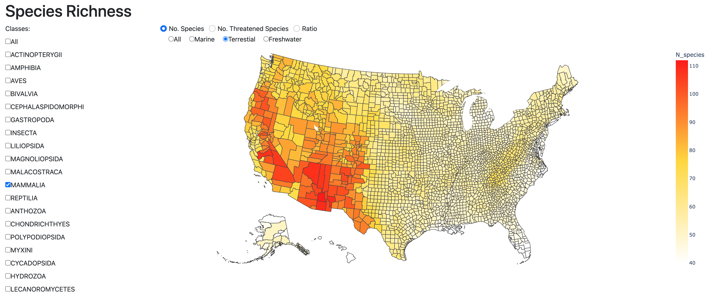

# biodiversityrisk-species-richness

Dash App Deployed using Render
https://dashboard.render.com/

Deployed App: https://biodiversityrisk-species-richness.onrender.com

Examples:
- Total Number of Species of Mammalia - County Level

- Number of Threatened Species of Mammalia - County Level

Notes:
- Species data are based on the IUCN Red List of Threatened Species
- Selection of multiple species classes is available (check the boxes)
- Ratio = Aggregate No. threatened species / Aggregate No. total species (of selected classes)
